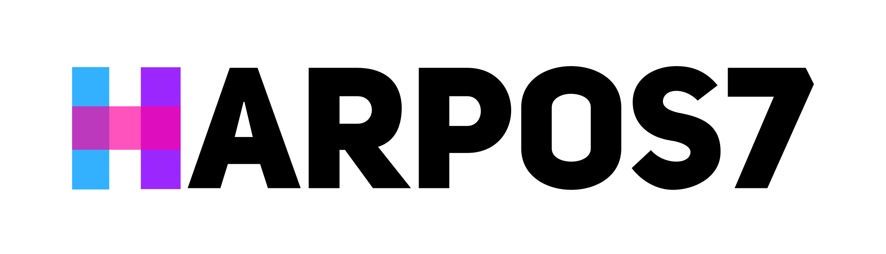

HarpoS7 is a C# library designed to authenticate sessions in the S7 Comm Plus protocol. It supports both **legacy
challenge** authentication (found in projects made using TIA Portal V16 and older) and the more recent TLS 
authentication introduced in project made using TIA Portal V17 and newer.

HarpoS7 is intended for integration into other libraries and frameworks rather than as a standalone tool 
for end users.

## Features
- Fully managed
- Supports challenge-based authentication (pre-V17 TIA portal)
- Supports TLS authentication (post-V17 TIA portal)
- Supports legitimation (password authorization)

### Tested on
- S7-1200 (1211C DC/DC/relay, 6ES7211-1HE40-0XB0) - tested by [Siephs](https://github.com/Siephs)
- S7-1200 (1214C DC/DC/DC, 6ES7214-1AG40-0XB0)
- S7-1200 (1214C AC/DC/relay, 6ES7214-1BG40-0XB0) - tested by [Peter Belica](https://github.com/peterbelica)
- S7-1500 (1516-3 PN/DP, 6ES7516-3AN02-0AB0) - tested by [Schneggo](https://github.com/Schneggo)
- S7-PLCSIM V16 (PLC: S7-1200)
- S7-PLCSIM V18 (PLC: S7-1500)

## Getting started
For a comprehensive example of how to use HarpoS7, explore the [HarpoS7.PoC](HarpoS7.PoC) project included in
the repository.

This project provides a hands-on demonstration of how to integrate HarpoS7 into a sample application. Follow 
the example code and comments to fully understand how to use the library.

### Public keys
Since 1.1.0 the default public keys are integrated into the library.

If you want to use a custom public key, you can implement your own 
[IPublicKeyStore](HarpoS7.PublicKeys/Interfaces/IPublicKeyStore.cs)
or pass in a raw public key to the [Authenticate](HarpoS7/Auth/LegacyAuthenticationScheme.cs) 
function directly.

### Legacy auth usage
In order to authenticate a legacy session (challenge-based):
```csharp
using HarpoS7.Auth;
using HarpoS7.PublicKeys.Impl;

// The "input" buffers - you have to load/fill them yourselves
// The "output" buffers - the library fills them

// Input - challenge received from the PLC (20 bytes long)
var challenge = new byte[20];

// Input - public key used by the PLC (loaded from local storage, 
// can be identified by the fingerprint sent by the PLC)
var exampleFingerprint = "00:181B7B0847D1169";
var store = new DefaultPublicKeyStore();
var publicKey = new byte[store.GetPublicKeyLength(exampleFingerprint)];
store.ReadPublicKey(publicKey.AsSpan(), exampleFingerprint);

// Input - public key family (must be read from the fingerprint)
// Example: 00:181B7B0847D11694, the 00 before the ':' is the public key family
// Currently the 00, 01 and 03 families are supported.
var family = EPublicKeyFamily.S71500;

// Output - "Encrypted key" which you send back to the PLC (216 bytes long)
var keyBlob = new byte[Constants.FinalBlobDataLength];

// Output - Session key used later on to calculate packet integrity hashes (24 bytes long)
var sessionKey = new byte[Constants.SessionKeyLength];

LegacyAuthenticationScheme.Authenticate(
    keyBlob.AsSpan(),
    sessionKey.AsSpan(),
    challenge.AsSpan(),
    publicKey.AsSpan(),
    family);
```

In order to calculate a packet digest (these are used to prevent tampering):
```csharp
// Input - your packet data (without the S7-Header and S7-Trailer)
var data = new byte[dataLength];

// Input - session key (output from LegacyAuthenticationScheme.Authenticate)
var sessionKey = new byte[Constants.SessionKeyLength];

// Output - the packet data digest, usually placed in the S7-header
var digestBuffer = new byte[HarpoPacketDigest.DigestLength];

HarpoPacketDigest.CalculateDigest(digestBuffer.AsSpan(), data, sessionKey);
```

## TLS auth
It is important to note that although TLS authentication is present in HarpoS7, it should be treated as a proof
of concept rather than a ready-to-use solution. 

The reason is that the implementation is simply the built-in SslStream
wrapped around a primitive [CotpStream](HarpoS7/Transport/CotpStream.cs).

## Legitimation
It is possible to authorize with a password against a password-protected PLC.

In order to authorize with a password you need to firstly obtain a valid session (using TLS or legacy auth scheme).
Then you need to get a legitimation challenge using a GetVarSubStreamed request (use Wireshark to know how).
Finally, you can pass everything down to the ```SolveLegitimateChallenge``` function.

### Example
```csharp
using HarpoS7.Auth;

var blobData = new byte[LegitimateScheme.OutputBlobDataLength];
LegitimateScheme.SolveLegitimateChallenge(
    blobData, // OUT - send this with SetVarSubStreamed
    challenge, // IN - get this with GetVarSubStreamed
    publicKey, // IN - get this from a local storage by matching the fingerprint sent by the PLC
    family, // IN - public key family (must be read from the fingerprint)
    sessionKey, // IN - generated by LegacyAuthenticationScheme.Authenticate (TODO: check TLS)
    "password"); // IN - password required by the PLC
```

## Credits
- [Thomas_v2, Wireshark dissector plugin](https://sourceforge.net/projects/s7commwireshark/) - a Wireshark plugin used 
  for dissecting S7-Comm Plus packets.
- [Cheng Lei, Li Donghong, Ma Liang, The spear to break the security wall of S7CommPlus](https://www.blackhat.com/docs/eu-17/materials/eu-17-Lei-The-Spear-To-Break%20-The-Security-Wall-Of-S7CommPlus-wp.pdf) - a document describing the S7-Comm Plus protocol
- [Ghidra Software Reverse Engineering Framework](https://github.com/NationalSecurityAgency/ghidra) - "Ghidra is a software reverse engineering (SRE) framework created and maintained by the National Security Agency Research Directorate."
- [x64dbg](https://github.com/x64dbg/x64dbg) - "An open-source user mode debugger for Windows. Optimized for reverse engineering and malware analysis."
